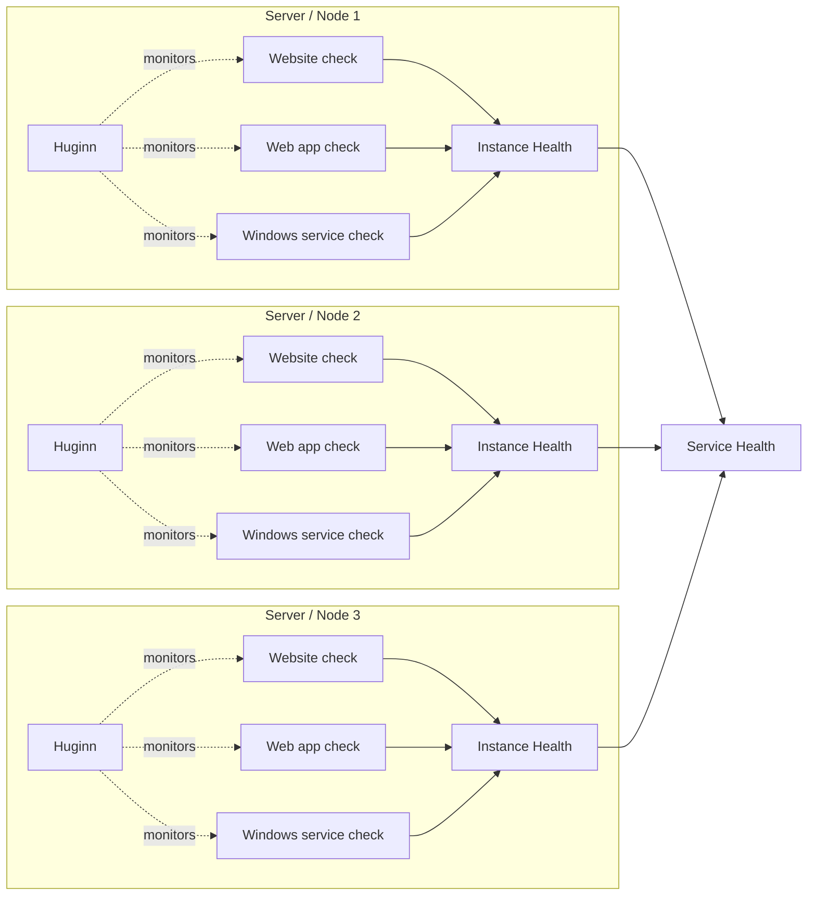
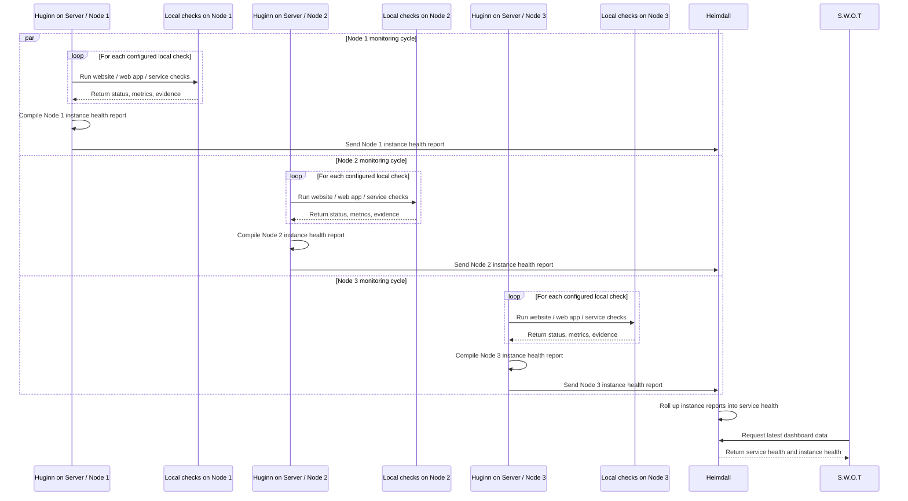

# Heimdal MVP Requirements

## Purpose

This document defines the minimum viable product requirements for the Heimdal platform.

Heimdal is the backend platform behind `S.W.O.T` (`Software Well-being Observability Tool`), a public, read-only status dashboard for operational visibility of monitored systems.

The MVP is intended to provide a simple, useful first version that can be deployed in organisational environments, home labs, and personal or family-hosted environments.

## Product Summary

The Heimdal MVP consists of four core components:

- `S.W.O.T` - the user-facing web dashboard
- `Heimdall` - the API and application layer
- `Muninn` - the storage layer
- `Huginn` - the monitoring client

The platform allows monitored systems to push heartbeat, health, and stat data into a central backend, where it is stored, interpreted, and presented through a public read-only dashboard.

## MVP Goals

The MVP should:

- provide a simple public dashboard for service visibility
- show the current state of monitored systems
- show whether monitoring data is live, stale, or unknown
- support both service-level and instance-level visibility
- support configurable stats with simple threshold handling
- support labels for grouping and filtering
- be simple to deploy and operate
- be useful without requiring a full admin UI

## Non-Goals

The MVP does not aim to provide:

- dashboard access control
- dashboard audit logging
- a full administration interface
- multi-environment support within one deployment
- alerting or notification workflows
- operational actions from the dashboard
- tenant isolation or per-team segregation
- browser-based synthetic test execution

## Deployment Scope

Each Heimdal deployment is production-only.

If non-production visibility is required, such as UAT, it should be handled through a separate deployment rather than through multi-environment support inside a single instance.

## Target Users

The MVP is intended to be useful for users such as:

- developers
- support staff
- service owners
- technical leads
- home lab operators
- self-hosting users
- any other stakeholder who needs read-only visibility of service health

## Core Concepts

### Monitored Service

A monitored service is made up of one or more monitored instances.

Each monitored instance typically represents a server or node running a local Huginn client. That Huginn client is configured to monitor the websites, web apps, Windows services, pages, endpoints, or other deployed components on that server.

The health of those local checks rolls up into an instance health state for that server.

The health of all instances then rolls up into the overall service health shown on the dashboard.

## Functional Requirements

## 1. Dashboard Requirements

### 1.1 Public read-only access

The `S.W.O.T` dashboard must be publicly viewable within the context of its deployment.

The dashboard must be read-only in the MVP.

The dashboard must not provide operational write actions in the MVP.

### 1.2 Overview display

The dashboard must provide an overview screen that shows all configured monitored objects.

For each monitored object, the overview should show:

- name
- type
- current service-level status
- freshness of the latest monitoring data
- last update time
- selected configurable stats
- labels
- a short current message where available

### 1.3 Detail display

The dashboard must provide a detail view for each monitored object.

The detail view should show:

- object metadata
- current roll-up status
- current freshness state
- instance list
- per-instance status
- recent status history
- recent stat history
- labels
- latest message

### 1.4 Auto-refresh

The dashboard must support automatic refresh without requiring manual page reload.

The refresh interval should support near real-time visibility.

### 1.5 Filtering and grouping

The dashboard must support filtering and grouping using labels.

The initial label model should be simple and deployment-configurable.

### 1.6 Branding

The dashboard must support configurable branding.

Branding should include values such as:

- dashboard title
- colours
- favicon paths
- branding icon paths
- similar deployment identity values

For the MVP, branding values should be configurable through application configuration.

## 2. Monitoring Requirements

## 2.1 Push model

The platform must use a push-based monitoring model.

Monitored systems must report into the platform rather than requiring the platform to poll them by default.

## 2.2 Monitoring client

The platform must provide a monitoring client, `Huginn`, which can be attached to monitored systems.

The monitoring client must be able to submit:

- heartbeat data
- status
- message text
- stat values
- instance metadata

### 2.3 Initial target support

The MVP should support monitored targets such as:

- web applications
- Windows services
- websites
- servers
- similar runtime or deployable components

### 2.4 .NET-first integration

The first client implementation should support .NET applications and services.

### 2.5 Retry behaviour

The monitoring client must handle temporary submission failures sensibly.

It should retry transient failures without creating excessive retry storms.

### 2.6 Low overhead

The monitoring client should be lightweight and safe to run in production systems.

## 3. Data Submission Requirements

Each monitoring submission must be able to include:

- monitored object name
- monitored object type
- instance name
- host name, where applicable
- timestamp
- current status
- message
- labels
- stat values
- version or build information, where available

The submission format should be consistent across monitored targets.

## 4. Status Requirements

## 4.1 Status model

The MVP status model must support the following states:

- Healthy
- Degraded
- Unhealthy
- Stale
- Unknown
- Maintenance

## 4.2 Freshness rules

Monitoring data must be interpreted using the following freshness rules:

- 0 to 60 seconds old: live
- more than 60 seconds old and up to 5 minutes old: stale but still valid
- more than 5 minutes old: unknown

These rules must be applied consistently across the platform.

## 4.3 Roll-up rules

The platform must support service-level roll-up from instance-level state.

The default roll-up behaviour should be:

- if any instance is Unhealthy, the monitored object is Unhealthy
- else if any instance is Degraded, the monitored object is Degraded
- else if any instance is Stale, the monitored object is Stale
- else if all valid instances are Healthy, the monitored object is Healthy
- else if no valid recent data exists, the monitored object is Unknown

## 5. Stat Requirements

## 5.1 Configurable stats

The platform must support configurable stats for monitored objects.

Each stat definition should support, where relevant:

- key
- display name
- unit
- value type
- high warning threshold
- high critical threshold
- low warning threshold
- low critical threshold
- visibility on overview

## 5.2 Threshold handling

Thresholds should influence the interpreted health state of a monitored object or instance where configured.

## 6. Label Requirements

The platform must support labels on monitored objects.

Labels must support:

- filtering
- grouping
- simple categorisation

Examples may include:

- owner
- category
- platform
- criticality

## 7. Configuration Requirements

## 7.1 Central configuration

Dashboard-related configuration must be stored centrally rather than hard-coded into the UI.

This includes configuration such as:

- monitored object definitions
- stat definitions
- dashboard presentation settings
- branding values
- label-related behaviour

## 7.2 Configuration editing

The MVP does not require an admin UI.

Configuration may be edited directly in the underlying configuration store or deployment configuration.

A future admin view is intended but is outside MVP scope.

## 8. API Requirements

`Heimdall` must provide an API layer that supports:

- ingestion of monitoring submissions
- validation of submitted payloads
- reading current state for the dashboard
- reading recent history for the dashboard
- access to configuration data required by the dashboard

The API must act as the single application-facing interface between the UI, monitoring client, and storage layer.

## 9. Storage Requirements

`Muninn` must persist:

- monitored object definitions
- monitored instance definitions
- current status values
- current stat values
- status history
- stat history
- dashboard configuration
- branding configuration

The storage layer should support efficient reads for overview and detail views.

A relational model is acceptable for the MVP.

## 10. Security Requirements

## 10.1 Dashboard viewing

The MVP dashboard must not require user access control.

## 10.2 Dashboard auditing

The MVP must not include dashboard audit logging.

## 10.3 Ingestion integrity

Although the dashboard is public, monitoring submissions should be protected against unauthorised writes.

A lightweight protection mechanism is sufficient for MVP.

Examples include:

- a shared API key
- a deployment-level client secret

The exact implementation may be finalised during technical design.

## Non-Functional Requirements

## 11. Performance

The platform should support at least tens to low hundreds of monitored objects without difficulty in the MVP.

The dashboard should load quickly and refresh reliably.

Monitoring submissions should be processed quickly enough to support near real-time visibility.

## 12. Reliability

The platform should preserve the last known valid state during short interruptions.

Temporary client, network, or backend failures should result in data becoming stale and then unknown according to the defined freshness rules, rather than disappearing immediately.

## 13. Simplicity

The MVP should prefer a simple and understandable implementation over early optimisation or broad feature scope.

## 14. Operability

The platform should be easy to deploy, understand, and extend.

It should be practical to add new monitored objects without changing the fundamental platform design.

## Out of Scope

The following are explicitly out of scope for the MVP:

- admin UI for end-user configuration
- alerting and notification workflows
- dashboard write actions
- dashboard access control
- dashboard audit logging
- multi-environment support in one deployment
- per-team tenancy boundaries
- synthetic browser testing in the monitoring client
- long-term analytics and aggregation features

## Future Considerations

The following are not MVP requirements, but are recognised as future directions:

- admin UI for dashboard configuration
- richer charts and visualisations
- multi-environment support
- alerting and notification workflows
- probe-based monitoring for targets without an attached client
- synthetic browser testing through the monitoring client
- longer-term historical aggregation and reporting

## Acceptance Summary

The MVP can be considered successful if it provides:

- a working public read-only dashboard
- service-level and instance-level visibility
- a push-based monitoring client
- consistent freshness handling
- configurable stats with simple thresholds
- label-based filtering/grouping
- persisted current and recent monitoring data
- configurable branding and dashboard behaviour without requiring an admin UI

## Summary

The Heimdal MVP is a simple, production-focused monitoring platform built around a public read-only dashboard and a lightweight push-based monitoring client.

Its purpose is to provide a clear and useful view of service health and selected stats without introducing unnecessary complexity in the first release.