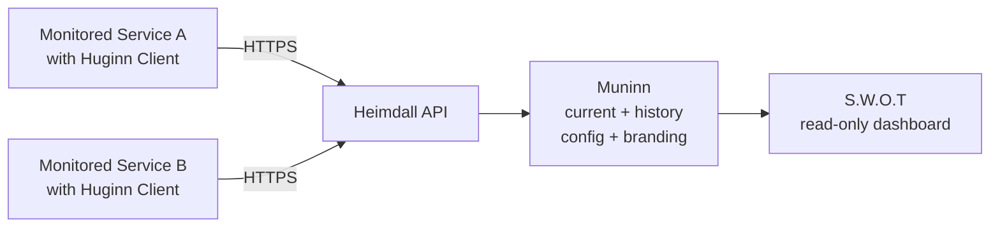

# Heimdall Architecture

## Purpose

This document describes the initial architecture for Heimdall.

Heimdall is the backend project and platform behind `S.W.O.T` (`Software Well-being Observability Tool`), a public, read-only status dashboard for operational visibility of monitored systems.

The platform is designed to be generally useful across different environments and scales, including open source use, workplace deployments, home labs, and personal or family-hosted services. It is backed by a lightweight monitoring client that pushes heartbeat, status, and stat data to a central backend.

This document focuses on the MVP architecture and intentionally keeps the design simple.

## Naming

`Heimdall` is the project and backend/platform name.

`S.W.O.T` is the user-facing dashboard product name.

In this document:

- `Heimdall` refers to the backend platform, API, storage, and monitoring ecosystem
- `S.W.O.T` refers to the web dashboard UI presented to end users

## Architectural Goals

The architecture should support the following goals:

- provide a simple public dashboard for operational visibility
- support near real-time status updates
- allow monitored systems to push their own health and stats
- support both service-level and instance-level visibility
- keep configuration simple through thresholds and labels
- support configurable branding and dashboard identity
- remain easy to deploy, understand, and extend
- remain useful for both organisational and personal/self-hosted deployments

## Scope

### In scope for MVP

- public read-only dashboard
- production-only deployment model
- push-based monitoring
- near real-time updates
- service-level roll-up views
- instance-level detail views
- configurable thresholds
- configurable labels
- recent status and stat history
- configurable dashboard branding
- centrally stored dashboard configuration

### Out of scope for MVP

- dashboard access controls
- dashboard auditing
- user-editable dashboards through an admin UI
- alerting and notification workflows
- operational actions from the UI
- multi-environment support within a single deployment
- tenancy boundaries or per-team isolation
- browser-based synthetic testing from the monitoring client

## High-Level Architecture

Heimdall consists of four main parts:

1. S.W.O.T - Web Dashboard UI
2. Heimdall - API Layer
3. Muninn - Storage layer
4. Huginn - Monitoring client

### Logical view

