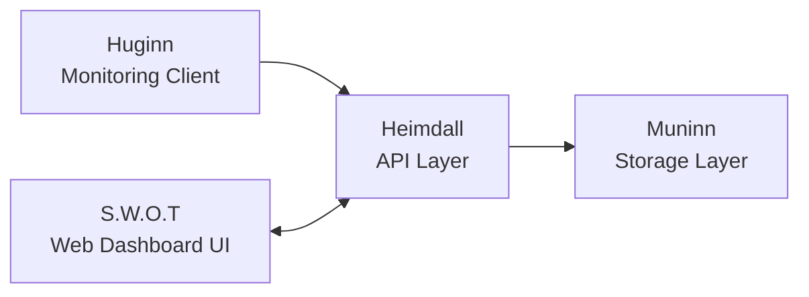
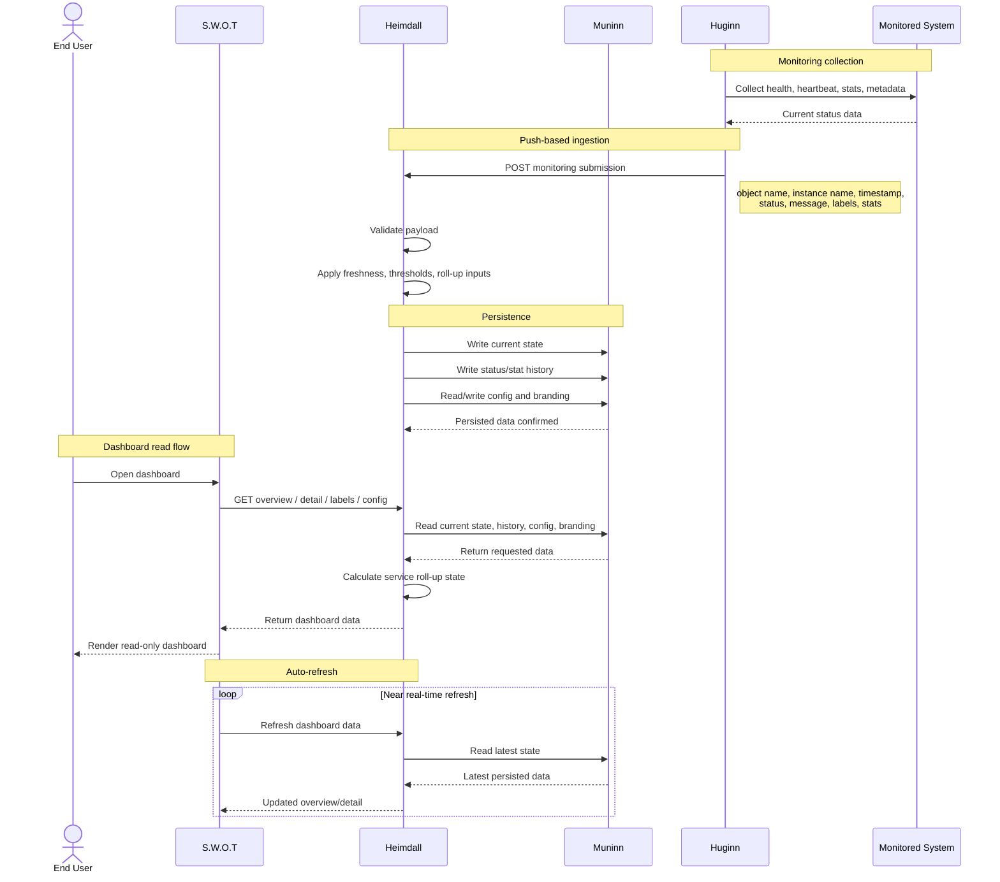

# Platform Relationships

## Purpose

This document describes how the core Heimdall platform services relate to one another.

It explains the role of each named component and how data flows through the platform in the MVP.

## Platform Overview

The platform is made up of four main components:

1. S.W.O.T
2. Heimdall
3. Muninn
4. Huginn

Each component has a distinct responsibility, but they work together as one monitoring and status platform.

## Component Roles

## S.W.O.T

S.W.O.T (`Software Well-being Observability Tool`) is the user-facing web dashboard.

It is responsible for presenting monitoring information in a simple, read-only format for end users.

S.W.O.T is the presentation layer.

## Heimdall

Heimdall is the backend API and application layer.

It is responsible for receiving monitoring data, applying platform rules, and serving data to the dashboard.

Heimdall is the central coordination layer.

## Muninn

Muninn is the storage layer.

It is responsible for persisting monitoring state, monitoring history, dashboard configuration, and branding-related configuration.

Muninn is the persistence layer.

## Huginn

Huginn is the monitoring client.

It is responsible for gathering health, heartbeat, and stat information from monitored systems and pushing that information to Heimdall.

Huginn is the reporting edge of the platform.

## Relationship Summary

The relationship between the components can be described simply as:

- Huginn reports monitoring data into Heimdall
- Heimdall validates and processes that data
- Heimdall stores and reads platform data through Muninn
- S.W.O.T reads platform data from Heimdall
- End users view the resulting dashboard in S.W.O.T

## High-Level Flow

## Sequence Diagram 
